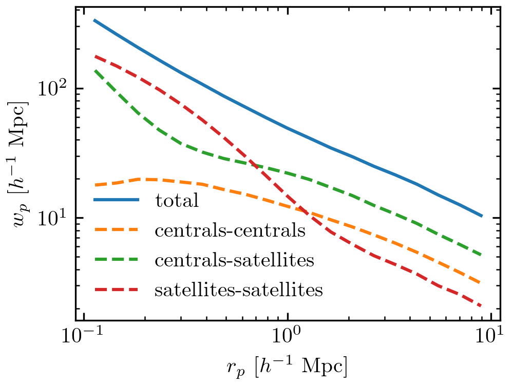
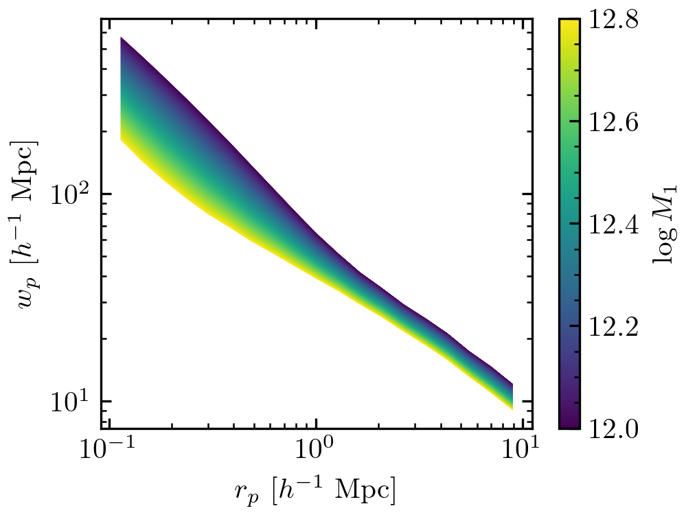

# TabCorr - Tabulated Correlation functions for halotools

This Python module provides extremely efficient and precise calculations of galaxy correlation functions in halotools using tabulated values. It is specifically intended for Markov chain monte carlo (MCMC) exploration of the galaxy-halo connection. It implements the method described in Zheng et al. (2016, http://adsabs.harvard.edu/abs/2016MNRAS.458.4015Z) of tabulating correlation functions that only need to be convolved with the mean halo occupation to obtain the full correlation function of galaxies.

---

### Prerequisites

The following python packages (and their prerequisites) are required for running this module.

* h5py
* numpy
* astropy
* halotools

This module has been tested with Python 3.x.

---

### Installation

The package can be installed via pip from the main directory.

```
pip3 install --user .
```

---

### Usage

The following code demonstrates the basic usage of TabCorr.

```
import numpy as np
from matplotlib import cm
from matplotlib import colors
import matplotlib.pyplot as plt
from halotools.sim_manager import CachedHaloCatalog
from halotools.mock_observables import wp
from halotools.empirical_models import PrebuiltHodModelFactory
from tabcorr import TabCorr

# First, we tabulate the correlation functions in the halo catalog.
rp_bins = np.logspace(-1, 1, 20)

halocat = CachedHaloCatalog(simname='bolplanck')
halotab = TabCorr.tabulate(halocat, wp, rp_bins, pi_max=40,
                           period=halocat.Lbox)

# We can save the result for later use.
halotab.write('bolplanck.hdf5')

# We could read it in like this. Thus, we can skip the previous steps in the
# future.
halotab = TabCorr.read('bolplanck.hdf5')

# Now, we're ready to calculate correlation functions for a specific model.
model = PrebuiltHodModelFactory('zheng07', threshold=-18)

rp_ave = 0.5 * (rp_bins[1:] + rp_bins[:-1])

ngal, wp = halotab.predict(model)
plt.plot(rp_ave, wp, label='total')

ngal, wp = halotab.predict(model, separate_gal_type=True)
for key in wp.keys():
    plt.plot(rp_ave, wp[key], label=key, ls='--')

plt.xscale('log')
plt.yscale('log')
plt.xlabel(r'$r_p \ [h^{-1} \ \mathrm{Mpc}]$')
plt.ylabel(r'$w_p \ [h^{-1} \ \mathrm{Mpc}]$')
plt.legend(loc='lower left', frameon=False)
plt.tight_layout(pad=0.3)
plt.savefig('wp_decomposition.png', dpi=300)
plt.close()

# Studying how the clustering predictions change as a function of galaxy-halo
# parameters is straightforward.

norm = colors.Normalize(vmin=12.0, vmax=12.8)
sm = cm.ScalarMappable(cmap=cm.viridis, norm=norm)
sm.set_array([])

for logm1 in np.linspace(12.0, 12.8, 1000):
    model.param_dict['logM1'] = logm1
    ngal, wp = halotab.predict(model)
    plt.plot(rp_ave, wp, color=sm.to_rgba(logm1), lw=0.1)

cb = plt.colorbar(sm)
cb.set_label(r'$\log M_1$')
plt.xscale('log')
plt.yscale('log')
plt.xlabel(r'$r_p \ [h^{-1} \ \mathrm{Mpc}]$')
plt.ylabel(r'$w_p \ [h^{-1} \ \mathrm{Mpc}]$')
plt.tight_layout(pad=0.3)
plt.savefig('wp_vs_logm1.png', dpi=300)
plt.close()

```

The above code will generate the following figures.




---

### To-do list

* TabCorr works for HOD and dHOD models. Support for SHAM models should be
easy to implement.

---

### Author

Johannes Ulf Lange
