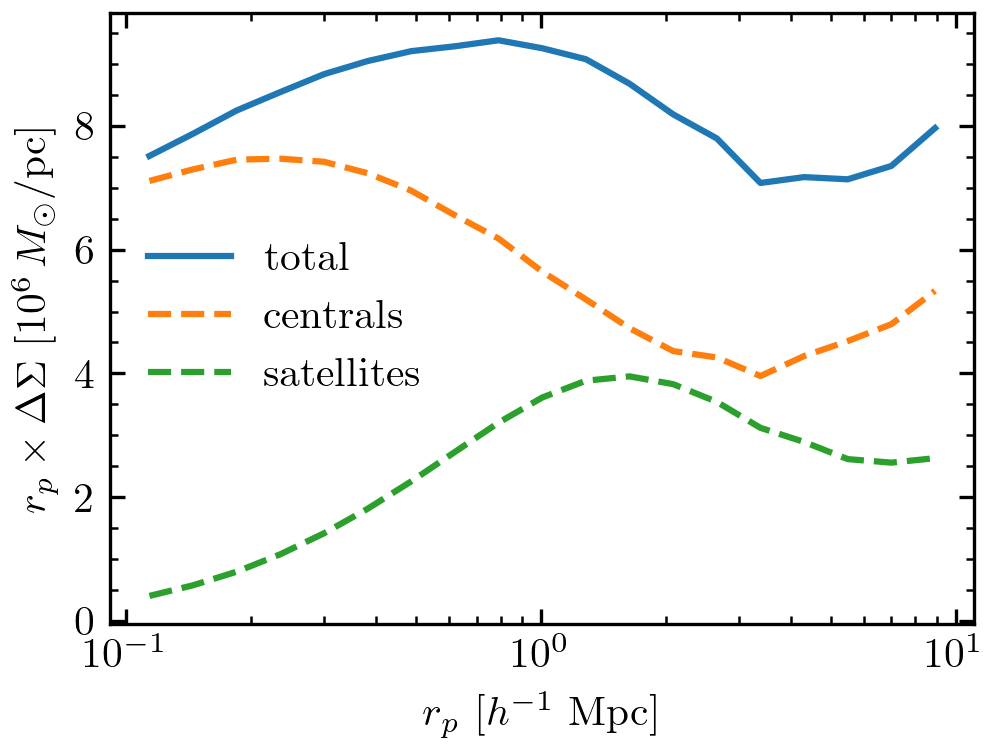

Galaxy-Galaxy Lensing
=====================

One can use ``TabCorr`` not only to compute galaxy clustering but also galaxy-galaxy lensing, a cross-correlation of the galaxies with the matter density field. To "tabulate" lensing for BolshoiP, we can use the following code snippet.

.. code-block:: python

    import numpy as np
    from halotools.mock_observables import mean_delta_sigma
    from halotools.mock_observables import return_xyz_formatted_array
    from halotools.sim_manager import CachedHaloCatalog
    from tabcorr import TabCorr

    # First, we tabulate the correlation functions in the halo catalog.
    rp_bins = np.logspace(-1, 1, 20)

    halocat = CachedHaloCatalog(simname='bolplanck')
    ptcl = halocat.ptcl_table
    pos_ptcl = return_xyz_formatted_array(ptcl['x'], ptcl['y'], ptcl['z'])
    effective_particle_mass = halocat.particle_mass * 2048**3 / len(ptcl)
    halotab = TabCorr.tabulate(
        halocat, mean_delta_sigma, pos_ptcl, effective_particle_mass, rp_bins,
        mode='cross', verbose=True, num_threads=4)

Now, we're ready to calculate lensing for a specific model. Just like for galaxy clustering, we can even decompose the total signal into contributions from centrals and satellites. However, since this is a cross-correlation function, we only have pure central and satellite components, no central-satellite terms.

.. code-block:: python

    import matplotlib.pyplot as plt
    from halotools.empirical_models import PrebuiltHodModelFactory

    model = PrebuiltHodModelFactory('zheng07', threshold=-21)

    rp_ave = 0.5 * (rp_bins[1:] + rp_bins[:-1])

    ngal, ds = halotab.predict(model)
    plt.plot(rp_ave, rp_ave * ds / 1e12, label='total')

    ngal, ds = halotab.predict(model, separate_gal_type=True)
    for key in ds.keys():
        plt.plot(rp_ave, rp_ave * ds[key] / 1e12, label=key, ls='--')

    plt.xscale('log')
    plt.xlabel(r'$r_{\rm p} \ [h^{-1} \ \mathrm{Mpc}]$')
    plt.ylabel(
        r'$r_{\rm p} \times \Delta\Sigma \ [10^6 \, M_\odot / \mathrm{pc}]$')
    plt.legend(loc='best', frameon=False)

